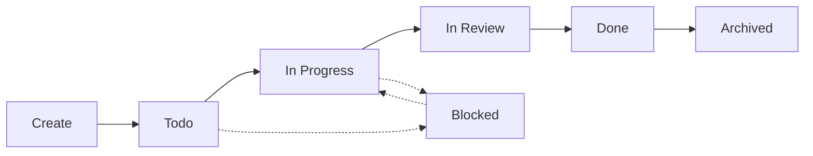

# Task Management

Comprehensive guide to managing tasks with KNL.

## Task Lifecycle



## Creating Tasks

### Basic Creation

```bash
# JIRA-style
knl create PROJ-123

# GitHub-style
knl create "#456"

# With title
knl create PROJ-123 --title "Add user authentication"
```

### Task ID Formats

**JIRA Format:**
- Pattern: `[A-Z][A-Z0-9]+-\d+`
- Examples: `PROJ-123`, `ABC-456`, `DEVOPS-789`

**GitHub Format:**
- Pattern: `#\d+`
- Examples: `#123`, `#456`
- Normalized to: `gh-123`, `gh-456` (for filesystem safety)

## Task Structure

Each task creates a directory with this structure:

```
.knowledge/tasks/PROJ-123/
├── metadata.json       # Task metadata and status
├── context.md          # Development context (editable)
├── tests/             # Task-specific test files
│   ├── test_feature.py
│   └── fixtures/
└── artifacts/         # Generated files
    ├── diagrams/
    └── logs/
```

### metadata.json

```json
{
  "task_id": "PROJ-123",
  "task_id_type": "jira",
  "normalized_id": "PROJ-123",
  "title": "Add user authentication",
  "description": "",
  "status": "todo",
  "created_at": "2025-12-29T10:30:00",
  "updated_at": "2025-12-29T10:30:00",
  "completed_at": null,
  "tags": [],
  "links": []
}
```

### context.md Template

````markdown
# PROJ-123: Add user authentication

## Description

[Task description from JIRA/GitHub or user input]

## Context

<!-- Add relevant context about this task -->

## Approach

<!-- Describe your implementation approach -->

## Progress

<!-- Track your progress here -->

## Notes

<!-- Any additional notes or learnings -->
````

## Viewing Tasks

### Show Task Details

```bash
knl show PROJ-123
```

Output:
```
Task: PROJ-123
Title: Add user authentication
Status: todo
Created: 2025-12-29 10:30:00
Updated: 2025-12-29 10:30:00

Context: .knowledge/tasks/PROJ-123/context.md
Tests: .knowledge/tasks/PROJ-123/tests/
Artifacts: .knowledge/tasks/PROJ-123/artifacts/
```

### List All Tasks

```bash
# All active tasks
knl list

# Filter by status
knl list --status todo
knl list --status in_progress
knl list --status in_review
knl list --status done

# Include archived
knl list --all
```

## Updating Tasks

### Update Status

```bash
# Standard workflow
knl task update PROJ-123 --status in_progress
knl task update PROJ-123 --status in_review
knl task update PROJ-123 --status done

# Special statuses
knl task update PROJ-123 --status blocked
knl task update PROJ-123 --status cancelled
```

### Update Title

```bash
knl task update PROJ-123 --title "New title"
```

### Update Description

```bash
knl task update PROJ-123 --description "Updated description"
```

### Add Tags

```bash
knl task update PROJ-123 --tags "feature,auth,security"
```

## Working with Task Context

### Editing Context

The `context.md` file is your workspace for notes:

```bash
# Open in your default editor
vim .knowledge/tasks/PROJ-123/context.md

# Or use any editor
code .knowledge/tasks/PROJ-123/context.md
```

### Context Best Practices

**Before Starting:**
- Document your understanding of the requirement
- Outline your planned approach
- Note any dependencies or blockers

**During Development:**
- Track decisions and rationale
- Document challenges and solutions
- Note learnings and insights

**After Completion:**
- Summarize what was implemented
- Document any deviations from plan
- Highlight key learnings for future tasks

## Managing Test Files

### Adding Tests

```bash
# Create test directory
mkdir -p .knowledge/tasks/PROJ-123/tests

# Add test files
touch .knowledge/tasks/PROJ-123/tests/test_authentication.py
```

### Test Organization

```
.knowledge/tasks/PROJ-123/tests/
├── test_auth_flow.py          # Main authentication tests
├── test_oauth_integration.py  # OAuth-specific tests
├── test_security.py           # Security tests
├── fixtures/                   # Test fixtures
│   ├── users.json
│   └── tokens.json
└── conftest.py                # Pytest configuration
```

### Running Task Tests

```bash
# Run all task tests
pytest .knowledge/tasks/PROJ-123/tests/

# Run specific test file
pytest .knowledge/tasks/PROJ-123/tests/test_auth_flow.py

# With coverage
pytest .knowledge/tasks/PROJ-123/tests/ --cov
```

## Artifacts

Store generated files in the artifacts directory:

```bash
# Architecture diagrams
.knowledge/tasks/PROJ-123/artifacts/diagrams/
├── auth_flow.png
└── database_schema.png

# API specifications
.knowledge/tasks/PROJ-123/artifacts/api/
└── openapi.yaml

# Performance logs
.knowledge/tasks/PROJ-123/artifacts/logs/
└── benchmark_results.txt
```

## Deleting Tasks

### Soft Delete

```bash
# Mark as archived (keeps data)
knl task update PROJ-123 --status archived
```

### Hard Delete

```bash
# Permanently delete
knl delete PROJ-123

# Skip confirmation
knl delete PROJ-123 --force
```

## Advanced Workflows

### Multi-Task Projects

Working on multiple related tasks:

```bash
# Create related tasks
knl create PROJ-123 --title "Backend API"
knl create PROJ-124 --title "Frontend UI"
knl create PROJ-125 --title "Integration tests"

# Link tasks in context.md
echo "## Related Tasks
- Backend: PROJ-123
- Frontend: PROJ-124
- Tests: PROJ-125
" >> .knowledge/tasks/PROJ-123/context.md

# Track progress across all
knl list --status in_progress
```

### Task Templates

Create custom templates for common task types:

```bash
# Create template
mkdir -p .knowledge/templates/
cat > .knowledge/templates/feature.md << 'EOF'
# {task_id}: {title}

## Requirements
<!-- List requirements -->

## Design
<!-- Design decisions -->

## Implementation
<!-- Implementation notes -->

## Testing
<!-- Test strategy -->

## Deployment
<!-- Deployment notes -->
EOF

# Use template (manual copy for now)
cp .knowledge/templates/feature.md .knowledge/tasks/PROJ-123/context.md
```

## Next Steps

- [Knowledge Base Guide](knowledge.md) - Understand the knowledge system
- [Git Integration](git.md) - Integrate tasks with git workflows
- [CLI Reference](../cli/tasks.md) - Complete task command reference
